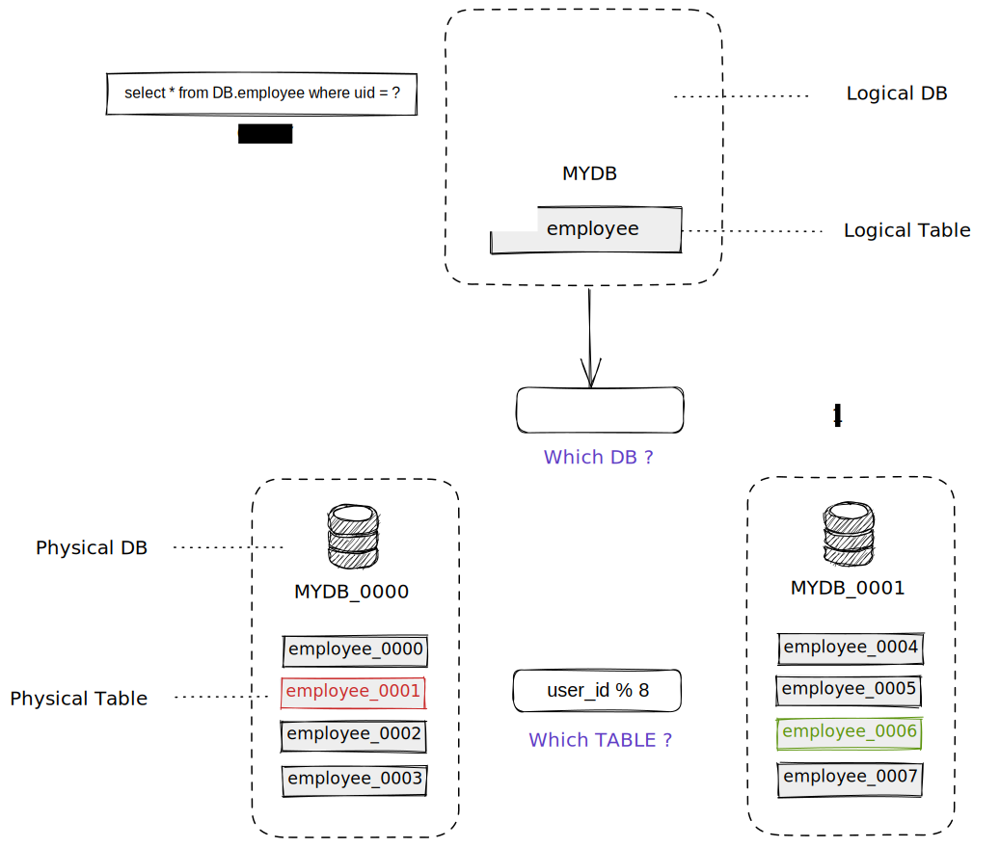

# 特性

## 术语概览

数据库访问代理在后端将数据量较大的数据表水平拆分到各个 MySQL 数据库中，后端的这些 MySQL 数据库被称为分库，分库中的表被称为分表。

其中微观上来看，每个分库实际对应至少1个物理 MySQL 数据库，而每个分表对应一张物理 MySQL 表。

拆分后，每个分库负责一份数据的读写操作，从而有效的分散了整体访问压力。在系统扩容时，只需要水平增加分库的数量，并且迁移相关数据，就可以提高数据库访问代理系统的总体容量。

一条简单的基于分库分表的查询语句执行过程大致可以提炼如下:

对齐进行抽象，可以得到如下信息:

- 其中用户提交的 SQL，我们称之为`逻辑SQL`
- 这条SQL所查询的库表我们称为`逻辑库`和`逻辑表`
- 代理会通过某个字段计算出实际的`分片`，这个字段称为`片键`，用于定义计算逻辑的分别称为`分库算法`和`分表算法`

> 猜猜看? `uid=9` 和 `uid=6` 分别最终路由到哪个物理库的哪个物理表?

## 分库分表

### 表拓扑

TODO: 介绍下表拓扑信息的相关概念

### 读写权重配置

TODO: 介绍下读写权重的配置及相关概念

### 分片算法

TODO: 介绍下常见的分片算法方式

## Sequence

TODO: 科普下sequence的概念

### Snowflake

TODO: 基于雪花算法的实现介绍及原理

### Segment Based

TODO: 基于段的实现介绍及原理

## 分布式事务
TODO: 介绍下分布式事务

## 影子表

TODO: 介绍下影子表的概念，原理以及如何配置影子表

## Tracing & Metrics

TODO: 介绍下链路追踪以及监控

## Logging

TODO: 介绍下日志，如逻辑SQL，物理SQL，事务，逻辑慢SQL，物理慢SQL等日志的配置
