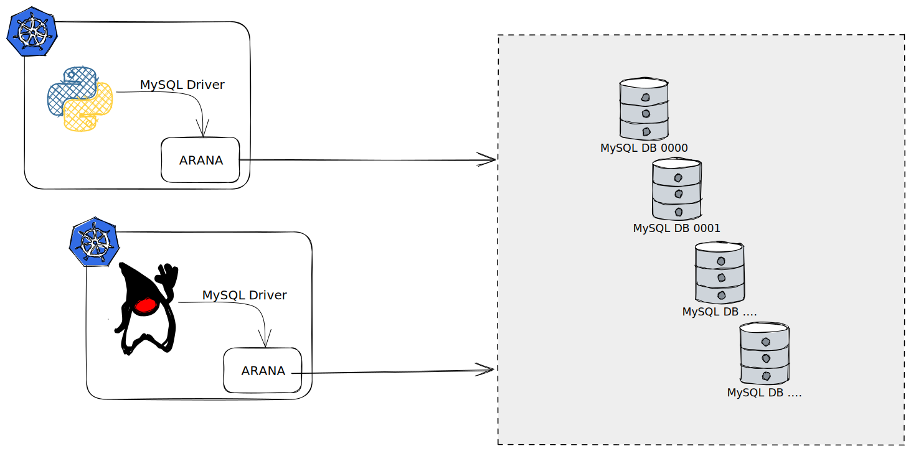

## 概览

### 介绍

Arana是一个面向数据库的中间件代理, 旨在基于已有的廉价MySQL集群之上提供强大的分库分表、读写分离、分布式事务、弹性扩展等能力。

Arana的最终的设计目标为实现DB-Mesh, 以sidecar的形式提供轻量的标准MySQL协议兼容服务, 使用上与访问普通MySQL一样的体验, 最大限度降低用户的集成使用成本。同时Arana最终的愿景是消除手动分库分表, 提供Shardless的自动分片。

### 产品功能

Arana以Go语言开发, 是一个100%开放开源的组织, 依托社区同学的努力迭代实现了丰富的产品功能:

| 特性 | 定义 |
|-----|-----|
| 数据分片 | 数据分片, 可以对海量数据做水平分割。Arana基于底层数据库提供分布式数据库解决方案，可以水平扩展计算和存储。|
| 分布式事务 | 数据库事务能力是一个基石, 提供分布式事务能力是每一个分布式数据库/中间件需要解决的难点。Arana依托XA事务提供了开箱即用的分布式事务能力。|
| 读写分离 | 数据库读写分离常用于解决高吞吐读写能力背景下的流量治理, Arana提供了基于灵活权重配置的流量治理能力, 您可依据实际情况配置对应的分流。|
| 高可用 | Arana可以将底层廉价的MySQL集群并联起来, 通过ETCD动态推送能力, 实现主从切换, 故障转移, 提供了高鲁棒性的解决方案。|
| JOIN查询 | 分布式数据库下涉及跨库JOIN, Arana提供了HashJoin以及SortMergeJoin等跨库JOIN的能力, 同时也引入了表组的概念, 可对一些跨库JOIN进行优化。|
| 影子库 | 很多业务会涉及全链路压测, Arana支持传递压测标HINT将压测流量下推到压测库表, 实现数据隔离, 避免压测数据污染。|

