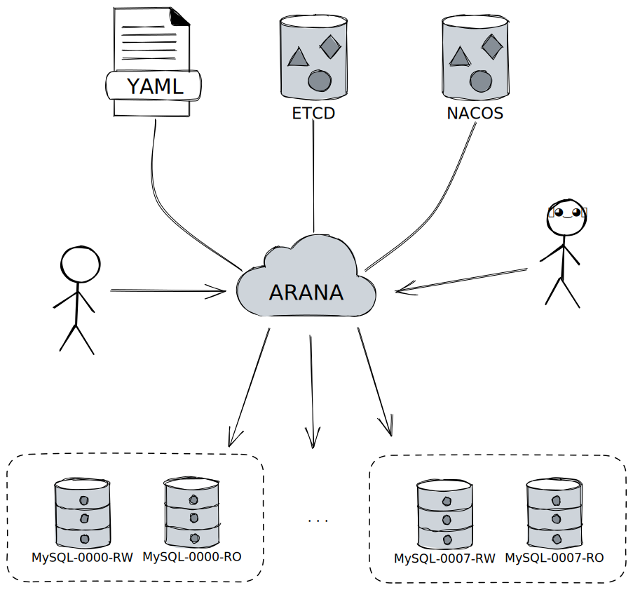

## 入门

### 配置源

Arana支持多种配置源, 包括基于配置文件的以及常见配置中心等, 甚至您可以通过实现内部API接口来自定义配置源。

#### YAML 文件

TODO: 简述下基于YAML文件的配置

#### ETCD

TODO: 简述下基于ETCD的配置样例

#### NACOS

TODO: 简述下基于NACOS文件的配置样例

### 启动

TODO: 简述下启动过程

#### Docker

TODO: 简述下通过`docker`启动

#### 构建并启动

TODO: 简述下如何从源码构建并启动
